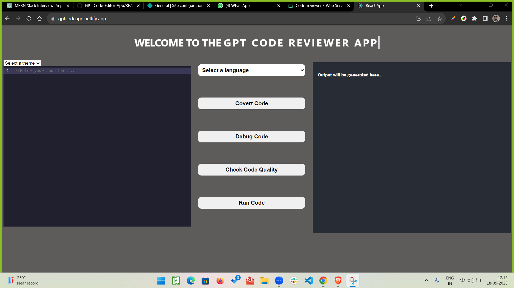

# GPT-Code-Editor-App
# CodeMaster

CodeMaster is your go-to tool for code conversion, debugging, and code quality analysis. Whether you need to transform code from one language to another, identify and resolve bugs, or ensure top-notch code quality, CodeMaster has you covered.

## Table of Contents

- [Features](#features)
- [Getting Started](#getting-started)
- [Usage](#usage)
- [Deployment](#deployment)
- [Screenshots](#screenshots)
- [Contributing](#contributing)
- [License](#license)

## Features

- *Code Conversion:* Seamlessly convert code from one programming language to another.
- *Debugging:* Identify and fix bugs in your code quickly and efficiently.
- *Code Quality Assessment:* Ensure your code meets the highest quality standards.

## Getting Started

To get started with CodeMaster, follow these steps:

1. *Clone the repository:* `git clone https://github.com/your-username/GPT-Code-Editor-App.git`
2. *Install dependencies:* `npm install` 
3. *Run CodeMaster:* `npm start` 

## Usage

1. *Code Conversion:* Enter the code you want to convert and select the target language.
2. *Debugging:* Upload your code, and CodeMaster will automatically identify and highlight any issues.
3. *Code Quality Assessment:* Analyze your code's quality and receive suggestions for improvement.

## Deployment

You can access a live deployment of CodeMaster by following this link: [CodeMaster Live](https://gptcodeapp.netlify.app/)

## Recorder Video
in case OPEN_AI_KEY expires refer to this video   [CodeMaster video]()
 
  
## Screenshots

Here are some screenshots of code reviwer app in action:

## License

This project is licensed under the MIT License - see the [LICENSE](LICENSE) file for details.
